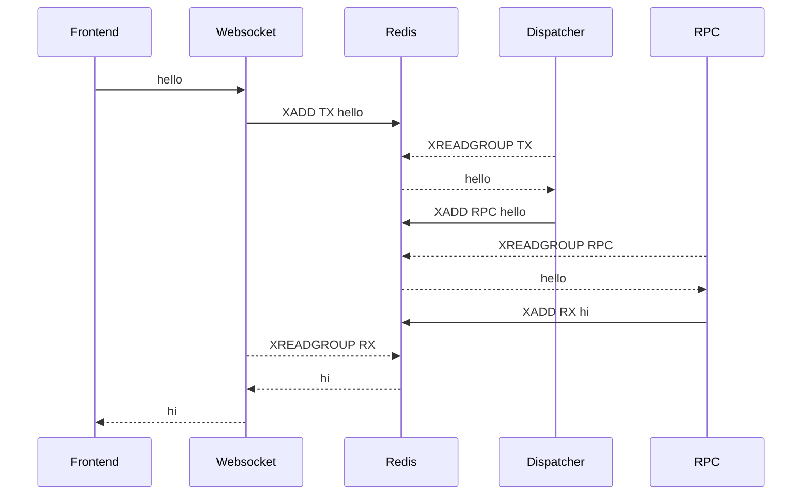
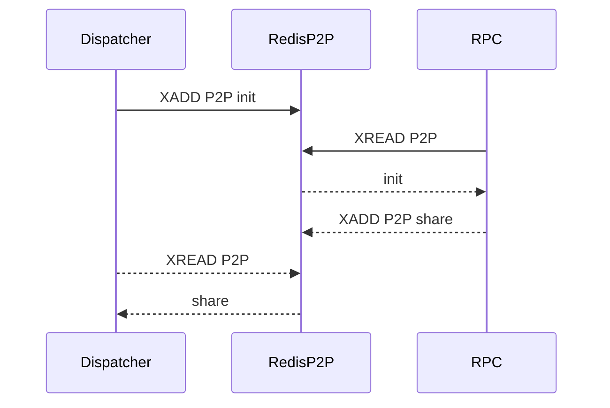
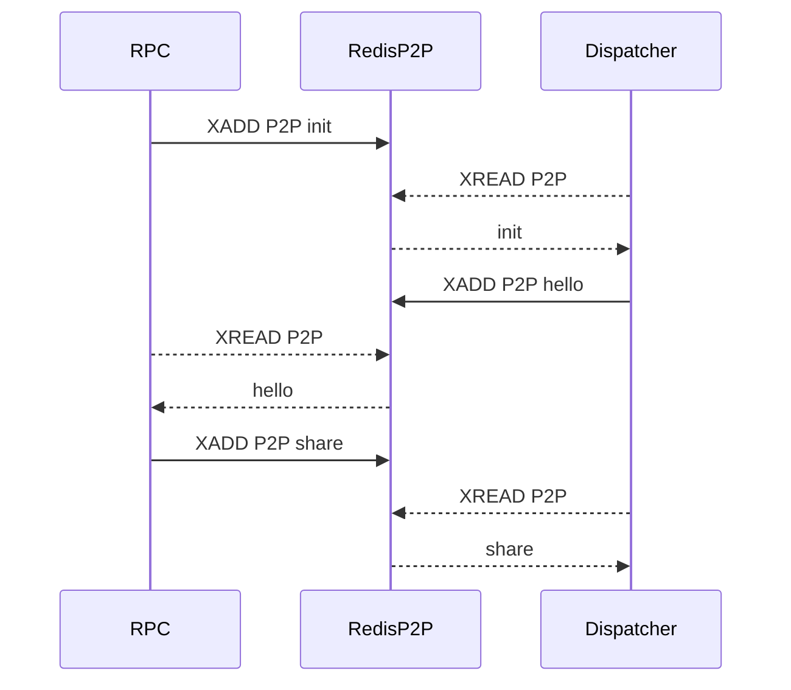

# ToxRox Core

Containerized stream-based websocket RPC architecture.

## Core Stack

- Node Typescript
- Redis Streams
- Docker

## Architecture

The ToxCore project offers a collection of packages, which, when put in containerized harmony, allow the underlying architecture to be deployed.

Every message received by the `websocket` is immediately streamed into the `dispatcher`, the dispatcher is responsible to stream the messages into the right stream to be consumed by the adequate `rpc`.

The `rpc` is responsible of the consumption of its own stream. The logic is implemented as `rpc handlers` which are totally independent from the core `rpc`.

Additionaly, each `rpc` is responsible to let know the `dispatcher` what messages is capable of consumption. This communication is handled on the background by a `p2p` network.

### P2P network

When the `dispatcher` initializes a `init` message is broadcasted, letting know all the online peers a new peer has become online needing all the `shards` from its peers to properly function. Each online `rpc` will dispatch the init message by broadcasting the `share` message including its own shard, carrying all the info about the messages it can consume.

If a `rpc` becomes online at any given point, it will also broadcast an `init` message letting all the online peers know there is a new rpc. This time however, the `dispatcher` reacts a bit differently as it actually needs the `shard` from this rpc and not other way around, the `hello` message is utilized by the dispatcher to let know the new rpc it has to `share` its shard.

**Note:** if the `dispatcher` don't know where to stream an incoming message it won't acknowledge it.

**Note:** the `dispatcher` will automatically reprocess not acknowledged messages each time a new `shard` is received.

### RPC separation

By subscribing to the `p2p` network the `dispatcher` will always know where to put the incoming message in order to get properly consumed. This lets you deploy many separate `rpc` that could `handle` specific domains of your overall system.

## Packages

Each package play a key role in the architecture.

- **consumer:** Redis streams consumer
- **streamer:** Redis streams feeder
- **websocket:** the architecture's `websocket`
- **disatcher:** the architecture's `dispatcher`
- **rpc:** the architecture's `rpc`
- **p2p:** the `p2p` network implementation
- **backend:** boilerplate `rpc handlers`
- **frontend:** boilerplate `playground` and `backoffice`

## Boilerplate

The project offers a boilerplate `backend` and `frontend` to start with, the idea is to use `txrx` as a module and eject both the `backend` and `frontend` to introduce the changes tailored to your needs.

### Backend

The boilerplate `backend` offers:

- General `rpc handlers`
- Auth `rpc handlers`, with basic calls implemented like login, logout, etc
- Ready to use `decorators` riced with `p2p` capabilities
- PostgreSQL database support
- Migrations and Database seeders

### Frontend

The boilerplate `frontend` offers:

- Webpack
- React
- Typescript
- Tailwind
- A `playground` page to poke the websocket
- An incomplete `backoffice` with just basic sign in/out capabilities
