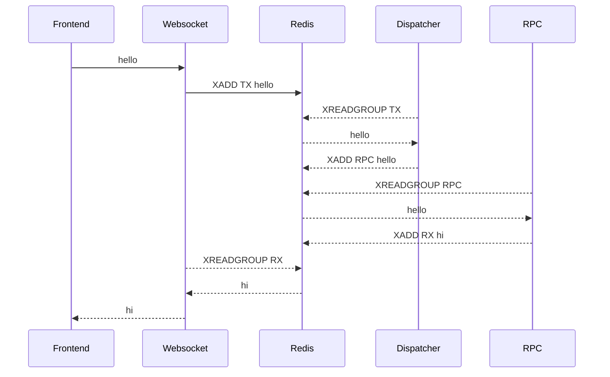

# ToxRox Core

Containerized stream-based websocket RPC architecture.

## Introduction

The ToxCore project offers a collection of packages, which, when put in containerized harmony, allow the underlying architecture to be deployed.

## Packages

Each package play a key role in the architecture.

- consumer: 
- streamer:
- disatcher:
- websocket:
- backend: 
- frontend:
- p2p:
- rpc:
