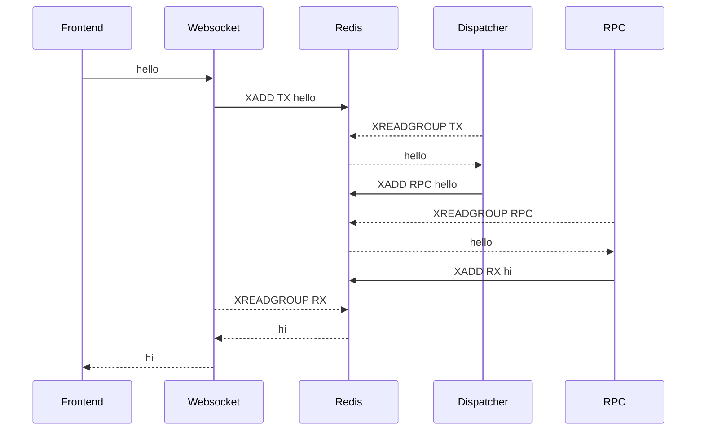
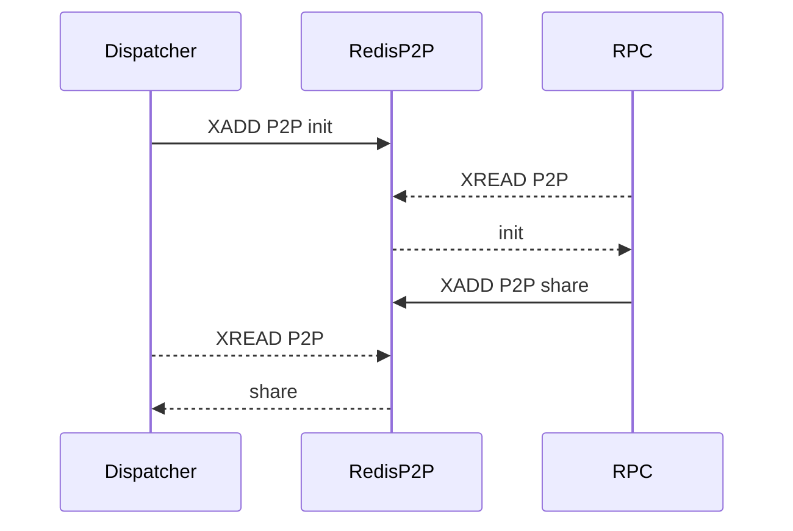
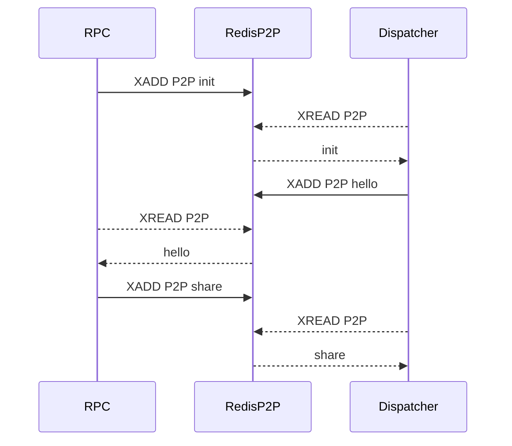
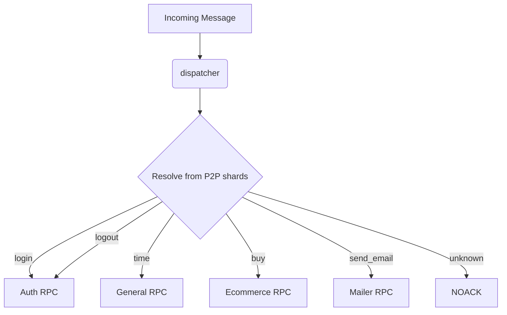

# ToxRox Core

Containerized stream-based websocket RPC architecture.

## Core Stack

- Node Typescript
- Redis Streams
- Docker
- OpenTelemetry/Jaeger

## Architecture

The ToxCore project offers a collection of packages, which, when put in containerized harmony, allow the underlying architecture to be deployed.

Every message received by the `websocket` is immediately streamed into the `dispatcher`, the dispatcher is responsible to stream the messages into the right stream to be consumed by the adequate `rpc`.

The `rpc` is responsible of the consumption of its own stream. The logic is implemented as `rpc handlers` which are totally independent from the core `rpc`.

Additionaly, each `rpc` is responsible to let know the `dispatcher` what messages is capable of consumption. This communication is handled on the background by a `p2p` network.

### P2P network

When the `dispatcher` initializes, a `init` message is broadcasted, letting all the online peers know a new peer has become online needing all the `shards` from its peers to properly function. Each online `rpc` will dispatch the init message by broadcasting the `share` message including its own `shard`, carrying all the info about the messages it can consume. A `shard` is simply an array of strings listing all the messages the rpc can dispatch itself.

If a `rpc` becomes online at any given point, it will also broadcast an `init` message letting all the online peers know there is a new rpc. This time however, the `dispatcher` reacts a bit differently as it actually needs the `shard` from this rpc and not other way around, the `hello` message is utilized by the dispatcher to let know the new rpc it has to `share` its shard.

Eventually the P2P network converges, the dispatcher has all the `shards` from the rpc peers, consequently therefore it can act as a dynamic message router.

**Note:** if the `dispatcher` didn't know where to stream an incoming message it won't acknowledge it.

**Note:** the `dispatcher` will automatically reprocess not acknowledged messages each time a new `shard` is received.

### RPC separation

By subscribing to the `p2p` network the `dispatcher` will always know where to put the incoming message in order to get properly consumed. This lets you deploy many separate `rpc` that could `handle` specific domains of your system on the fly, no need to restart the `dispatcher` nor the `websocket`.

**Note:** by implementing consuming groups, your `rpc` can easily horizontally scale.

## OpenTelemetry and Jaeger

The architecture is fully instrumentalized.

Tracing is implemented out of the box, the opentel collector propagates the traces towards a Jaeger container for visualization.

## Packages

Each package play a key role in the architecture.

- **consumer:** Redis streams consumer
- **streamer:** Redis streams feeder
- **websocket:** the architecture's `websocket`
- **disatcher:** the architecture's `dispatcher`
- **rpc:** the architecture's `rpc` core
- **p2p:** the `p2p` network implementation
- **backend:** boilerplate `rpc handlers`
- **frontend:** boilerplate `playground` and `backoffice`
- **telemetry:** opentel support for tracing

## Boilerplate

The project offers a boilerplate `backend` and `frontend` to start with, the idea is to use `txrx` as a module and eject both the `backend` and `frontend` to introduce the changes tailored to your needs.

### Backend

The boilerplate `backend` offers:

- General `rpc handlers`
- Auth `rpc handlers`, such as login, logout, etc
- Ready to use `decorators` riced with `p2p` capabilities
- PostgreSQL database support
- Migrations and Database seeders

### Frontend

The boilerplate `frontend` offers:

- Webpack
- React
- Typescript
- Tailwind
- A `playground` page to poke the websocket
- An incomplete `backoffice` with just basic sign in/out capabilities

## Ecosystem

You might have noticed this is a `monorepo` of sorts. The `docker-compose` is built in a way that bundles all together without many hassle.

In order to properly function, each container will only include the dependencies it really needs from the `monorepo` package collection.

Since all the dependencies are internally resolved, `ejection` from the core becomes trivial, letting us bring a collection of boilerplate `rpc handlers` aka the `backend`. As a nice side effect, this also let you deploy many `rpc containers` to separate your architecture into a myriad of specific domain `rpc`.

Generally speaking, as a baseline you will need:

- one unit of `websocket`, this is the only true `singleton` service
- one unit of `dispatcher`, although it can be horizontally scaled by adding more consumers to its `consuming group`
- one unit of `rpc`, if you wish you can `monolith` your rpc up, however the architecture let you both `separate` into domain specific rpc and also horizontally scale by adding more consumers.

**Note:** the `boilerplate` runs away from a `monolithic` rpc from the get go by separating the `auth handlers`.

## Getting started

We recommend to check out the instructions at the [ToxRox Ejector Project](https://github.com/ZelkZelk/txrx-ejector). 

By following the ejector `setup`, you will get an `ejected` **ToxRox** project ready to build upon.
